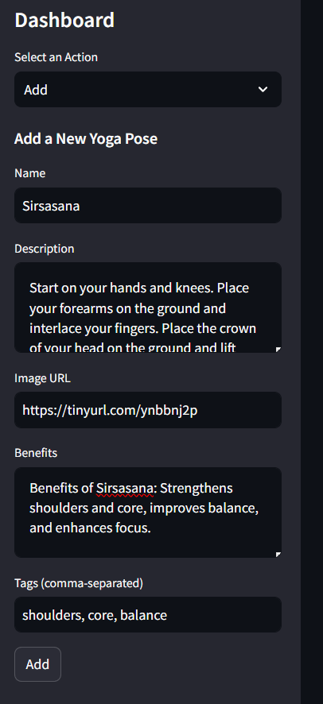

# Yoga Poses App

The Yoga Poses App is a web application that allows users to search, add, update, and delete yoga poses and their details. It provides a user-friendly interface for managing a yoga pose dictionary.

## Table of Contents
- [Features](#features)
- [Technologies Used](#technologies-used)
- [Getting Started](#getting-started)
- [Usage](#usage)
- [Screenshots](#screenshots)

## Features

- **Search Yoga Poses:** Users can search for yoga poses using keywords. The app provides search results with pose names, descriptions, and benefits.

- **Add New Poses:** Users can add new yoga poses by providing the name, description, image URL, benefits, and tags (comma-separated).

- **Update Poses:** Existing poses can be updated by selecting a pose and modifying its details, including name, description, image URL, and benefits.

- **Delete Poses:** Users can remove yoga poses from the database by selecting the pose they want to delete.

## Technologies Used

- **Streamlit:** The app's frontend is built using Streamlit, a Python library for creating web applications.

- **MySQL Database:** The app stores and retrieves yoga pose information from a MySQL database.

## Getting Started

1. **Clone the Repository:**

   ```bash
   git clone https://github.com/yourusername/yoga-poses-app.git
   cd yoga-poses-app

2. **Install Dependencies:**

   ```bash
   pip install streamlit mysql-connector-python
   
3. **Run the App:**

   ```bash
   streamlit run app.py
3. **Access the App:**
   Open your web browser and navigate to http://localhost:8501.

## Usage
- Upon running the app, you can start searching, adding, updating, or deleting yoga poses using the provided interface.

- The app connects to a MySQL database to manage the yoga pose dictionary. Ensure you have the required database set up and configure the database connection in the app.

## Screenshots
Search and view yoga poses.


Add a new yoga pose.



Update an existing yoga pose.


Delete a yoga pose.


